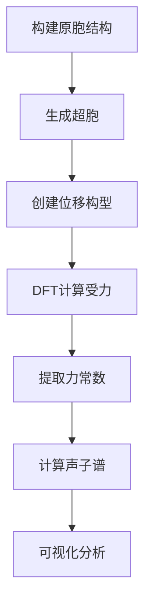

# 声子谱计算 | Phonon Spectrum Calculations

## 简介 | Introduction

本节介绍如何使用Phonopy软件计算固体材料的声子谱，包括使用第一性原理方法和深度学习势函数两种途径，并对比分析计算结果。

This section introduces how to calculate phonon spectra of solid materials using Phonopy software, including both first-principles methods and deep learning potentials, with comparative analysis of the results.

## 学习目标 | Learning Objectives

- 理解声子谱的物理意义和重要性
- 掌握Phonopy软件的基本使用
- 学习使用DFT计算力常数矩阵
- 了解如何使用深度学习势函数加速声子谱计算
- 对比分析不同方法的精度和效率

## 目录 | Contents

### 1. 理论基础 | Theoretical Background

- 晶格动力学基础 (Lattice Dynamics Fundamentals)
- 声子谱的物理意义 (Physical Meaning of Phonon Spectra)
- 有限位移法 (Finite Displacement Method)
- 力常数矩阵 (Force Constant Matrix)

📖 [理论文档](./tutorials/01_phonon_theory.md)

### 2. Phonopy基础 | Phonopy Basics

- Phonopy软件安装和配置
- 超胞构建 (Supercell Construction)
- 位移构型生成 (Displacement Configuration Generation)
- 力常数计算 (Force Constant Calculation)

📖 [Phonopy教程](./tutorials/02_phonopy_tutorial.md)

### 3. 实战示例 | Practical Examples

#### 方法一：Phonopy + DFT (GPAW)

使用第一性原理方法计算声子谱：

```python
# 示例：硅晶体声子谱计算
examples/01_phonopy_dft_silicon.py
```

**特点：**
- ✓ 高精度
- ✗ 计算耗时长
- ✗ 受限于超胞大小

💻 [完整代码](./examples/01_phonopy_dft_silicon.py)

#### 方法二：Phonopy + ML势函数 (Allegro/NequIP)

使用深度学习势函数加速计算：

```python
# 示例：使用Allegro势函数计算声子谱
examples/02_phonopy_mlp_silicon.py
```

**特点：**
- ✓ 计算速度快（100-1000倍）
- ✓ 可处理大超胞
- ✓ 接近DFT精度
- ✗ 需要预先训练势函数

💻 [完整代码](./examples/02_phonopy_mlp_silicon.py)

#### 方法三：结果对比分析

对比DFT和ML势函数的计算结果：

```python
# 示例：声子谱对比分析
examples/03_compare_phonon_results.py
```

💻 [完整代码](./examples/03_compare_phonon_results.py)

### 4. 高级应用 | Advanced Applications

- 声子态密度 (Phonon Density of States)
- 热力学性质计算 (Thermodynamic Properties)
- 声子群速度 (Phonon Group Velocity)
- 热导率计算 (Thermal Conductivity)

💻 [高级示例](./examples/04_advanced_phonon_analysis.py)

## 环境要求 | Requirements

### 必需软件 | Required Software

```bash
# 基础包
conda install numpy scipy matplotlib

# ASE - 原子模拟环境
pip install ase

# Phonopy - 声子计算
pip install phonopy

# GPAW - DFT计算 (方法一)
conda install -c conda-forge gpaw

# 或者使用Allegro/NequIP (方法二)
pip install nequip-allegro
```

### 可选软件 | Optional Software

```bash
# 用于更高级的可视化
pip install phonopy-spectroscopy
pip install phono3py  # 三阶力常数
```

## 快速开始 | Quick Start

### 1. 安装依赖

```bash
conda create -n phonon python=3.9
conda activate phonon
conda install -c conda-forge gpaw phonopy ase
pip install matplotlib seaborn
```

### 2. 运行第一个示例

```bash
cd examples
python 01_phonopy_dft_silicon.py
```

### 3. 查看结果

声子谱图像将保存在 `results/` 目录下。

## 计算流程 | Workflow

### 使用DFT计算声子谱



**详细步骤：**

1. **构建晶体结构**
   ```python
   from ase.build import bulk
   atoms = bulk('Si', 'diamond', a=5.43)
   ```

2. **生成超胞和位移**
   ```bash
   phonopy -d --dim="2 2 2" -c POSCAR
   ```

3. **计算受力**
   ```python
   # 对每个位移构型计算力
   calc = GPAW(...)
   atoms.calc = calc
   forces = atoms.get_forces()
   ```

4. **后处理**
   ```bash
   phonopy --fc vasprun.xml
   phonopy --band="0 0 0  0.5 0.5 0  0.5 0.5 0.5"
   ```

### 使用ML势函数计算

计算流程类似，但步骤3替换为：

```python
# 使用训练好的ML势函数
from nequip.ase import NequIPCalculator
calc = NequIPCalculator.from_deployed_model("deployed_model.pth")
atoms.calc = calc
forces = atoms.get_forces()  # 快速计算！
```

## 示例材料 | Example Materials

本教程提供以下材料的声子谱计算示例：

| 材料 | 晶体结构 | 难度 | 文件 |
|------|----------|------|------|
| Silicon (Si) | Diamond | 入门 | `01_phonopy_dft_silicon.py` |
| Germanium (Ge) | Diamond | 入门 | `examples/germanium/` |
| GaAs | Zinc Blende | 中级 | `examples/gaas/` |
| MgO | Rock Salt | 中级 | `examples/mgo/` |
| Graphene | 2D Hexagonal | 高级 | `examples/graphene/` |

## 性能对比 | Performance Comparison

基于硅晶体2×2×2超胞的计算：

| 方法 | 计算时间 | 相对速度 | 精度 |
|------|----------|----------|------|
| GPAW (DFT) | ~2小时 | 1× | 参考 |
| VASP (DFT) | ~1小时 | 2× | 参考 |
| Allegro (ML) | ~5分钟 | **24×** | ~95-99% |
| NequIP (ML) | ~8分钟 | **15×** | ~95-99% |

*注：实际性能取决于硬件配置和系统大小*

## 常见问题 | FAQ

### Q1: 声子谱出现虚频怎么办？

**A:** 虚频（负频率）通常表示结构不稳定。检查：
1. 结构是否已充分弛豫
2. 超胞是否足够大
3. DFT计算参数是否收敛

### Q2: 如何选择超胞大小？

**A:** 一般原则：
- 简单材料：2×2×2 或 3×3×3
- 复杂材料：根据计算资源调整
- ML势函数可以使用更大超胞（4×4×4 或更大）

### Q3: DFT和ML势函数结果差异很大怎么办？

**A:** 可能原因：
1. ML势函数训练数据不足
2. 训练数据未覆盖声子位移构型
3. 需要重新训练或使用主动学习

### Q4: 如何加速DFT声子计算？

**A:** 策略：
1. 使用对称性减少计算量
2. 并行化力计算
3. 使用较粗的k点网格（先验证收敛性）
4. 考虑使用ML势函数

## 参考资料 | References

### 软件文档

- [Phonopy官方文档](https://phonopy.github.io/phonopy/)
- [ASE文档](https://wiki.fysik.dtu.dk/ase/)
- [GPAW文档](https://wiki.fysik.dtu.dk/gpaw/)

### 学术论文

1. **Phonopy软件论文：**
   - Togo, A., & Tanaka, I. (2015). "First principles phonon calculations in materials science." *Scripta Materialia*, 108, 1-5.

2. **声子计算方法：**
   - Gonze, X., & Lee, C. (1997). "Dynamical matrices, Born effective charges, dielectric permittivity tensors, and interatomic force constants from density-functional perturbation theory." *Physical Review B*, 55(16), 10355.

3. **ML势函数用于声子：**
   - Minenkov, Y., et al. (2023). "Machine learning interatomic potentials for accurate phonon properties." *npj Computational Materials*, 9, 25.

### 教程和书籍

- Born, M., & Huang, K. (1954). *Dynamical Theory of Crystal Lattices*. Oxford University Press.
- Dove, M. T. (1993). *Introduction to Lattice Dynamics*. Cambridge University Press.

## 下一步学习 | Next Steps

完成本节后，您可以：

1. 学习更高级的声子计算（三阶力常数、声子-声子散射）
2. 计算材料的热力学性质（比热、自由能）
3. 研究声子输运性质（热导率）
4. 探索声子与电子的耦合（超导、极化子）

## 贡献 | Contributing

欢迎贡献新的示例和教程！请提交Pull Request。

---

**开始探索声子世界！🌊**
